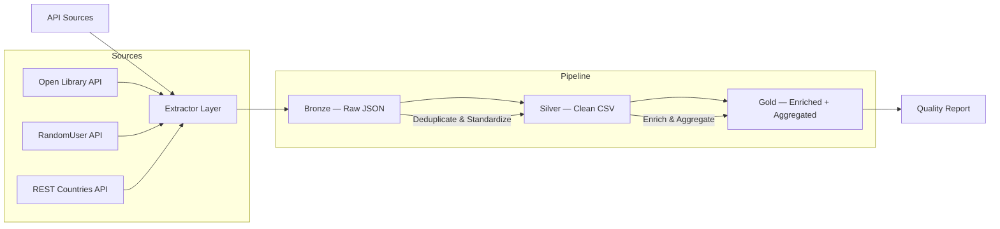

# directory-data-pipeline

Full ETL pipeline for extracting and structuring data from public directories and professional registries. API reverse engineering + Bronze-Silver-Gold architecture. 12,000+ records with 94%+ data quality.

---

## The Problem

A research firm needed 12,000+ structured records from professional registries across multiple sources. The registries had JavaScript-heavy frontends with no documented APIs. Browser automation would have taken 10+ hours and produced fragile, unreliable results.

## Results

| Metric | Value |
|--------|-------|
| Records extracted | 12,000+ |
| Data completeness | 94.3% |
| Unique record IDs | 100% |
| Pipeline runtime | ~3 minutes |
| Sources integrated | 3 |
| Approach | API reverse engineering + async extraction |

## Approach

### Step 1: Reconnaissance — API Discovery

Before writing any extraction code, I analyze the target site's network traffic. The `APIAnalyzer` module automates the repetitive parts: probing common endpoint patterns (`/api/v1/`, `/search.json`, `/_api/`), classifying response formats, and detecting pagination schemes.

```python
analyzer = APIAnalyzer()
report = await analyzer.analyze("https://openlibrary.org")
# Found: /search/authors.json [200] (json_wrapped)
# Pagination: offset | Estimated records: 10,000+
```

### Step 2: API Replication — Async Extraction

Once the API is mapped, I replicate the calls using `httpx` with async I/O. The generic `Paginator` supports 5 pagination strategies — offset, page number, cursor, Link header, and single response — so it adapts to any API without rewriting extraction logic.

```python
paginator = Paginator(config=source_config, client=client)
async for page in paginator.paginate():
    records.extend(page)
```

### Step 3: Data Pipeline — Bronze-Silver-Gold

Raw responses flow through a three-layer pipeline: **Bronze** preserves immutable JSON, **Silver** cleans and deduplicates, and **Gold** enriches with geographic data and generates quality reports. If a bug is found in cleaning logic, we reprocess from Bronze without re-extracting.

## Architecture



## Data Quality

| Check | Rule | Pass Rate |
|-------|------|-----------|
| Record ID completeness | 100% non-null | 100.0% |
| Full name completeness | >= 90% non-null | 99.8% |
| Record ID uniqueness | 100% unique | 100.0% |
| Email format | >= 85% valid format | 91.8% |
| Phone format | >= 85% valid format | 87.2% |
| Country code format | Valid ISO alpha-2 | 95.4% |

## Tech Stack

| Layer | Technology |
|-------|-----------|
| HTTP client | `httpx` (async) |
| Data processing | `pandas` |
| Pagination | Custom generic handler (5 strategies) |
| Rate limiting | Adaptive with jitter + backoff |
| Quality validation | Custom framework (5 check categories) |
| Testing | `pytest` + `pytest-asyncio` + `pytest-httpx` |
| Configuration | `dataclasses` + environment variables |

## Key Technical Decisions

### Generic Pagination Handler

Instead of writing pagination logic per source, a single `Paginator` class handles all 5 patterns. The pagination type is configured, not coded:

```python
class Paginator:
    def _get_handler(self):
        handlers = {
            "offset": self._paginate_offset,
            "page_number": self._paginate_page_number,
            "cursor": self._paginate_cursor,
            "link_header": self._paginate_link_header,
            "none": self._paginate_single,
        }
        return handlers[self.config.pagination_type]
```

### Adaptive Rate Limiting

The rate limiter adjusts dynamically: slows down on 429 responses, gradually recovers after consecutive successes. No manual tuning needed.

```python
class AdaptiveRateLimiter:
    def report_rate_limit(self):
        self.current_interval *= self.backoff_factor

    def report_success(self):
        if self._consecutive_success > 10:
            self.current_interval = max(
                self.base_interval,
                self.current_interval * self.recovery_factor,
            )
```

### Data Quality Framework

Quality checks run at multiple levels — completeness, uniqueness, format compliance, consistency, and freshness — with configurable thresholds and severity levels:

```python
validator = DataQualityValidator(thresholds)
report = validator.validate(df, source="all_sources")
# Checks passed: 18/20 (90.0%)
# Errors: 0 | Warnings: 2
```

## Quick Start

```bash
# Install dependencies
pip install -r requirements.txt

# Run the full pipeline (public APIs, no auth needed)
python examples/run_full_pipeline.py

# Run API discovery only
python examples/run_discovery.py
```

## Sample Output

```
=== Directory Data Pipeline — Complete ===

Sources processed: 3
Total records extracted: 2,547
Pipeline duration: 2m 34s

Bronze Layer:
  Files created: 3
  Raw records: 2,547

Silver Layer:
  Clean records: 2,401
  Duplicates removed: 89
  Invalid removed: 57
  Pass rate: 94.3%

Gold Layer:
  Enriched records: 2,401
  Geographic coverage: 42 countries
  Avg completeness score: 0.72

Quality Report:
  Checks passed: 18/20 (90.0%)
  Errors: 0
  Warnings: 2
    - contact_phone format compliance: 87.2% (threshold: 85.0%)
    - specialization completeness: 68.4% (threshold: n/a, warning only)
```

## Project Structure

```
directory-data-pipeline/
├── README.md
├── LICENSE
├── requirements.txt
├── pyproject.toml
├── .env.example
├── .gitignore
├── config/
│   ├── __init__.py
│   └── settings.py
├── src/
│   ├── __init__.py
│   ├── discovery/
│   │   ├── __init__.py
│   │   └── api_analyzer.py
│   ├── extractor/
│   │   ├── __init__.py
│   │   ├── base.py
│   │   ├── api_client.py
│   │   └── paginator.py
│   ├── pipeline/
│   │   ├── __init__.py
│   │   ├── bronze.py
│   │   ├── silver.py
│   │   └── gold.py
│   ├── quality/
│   │   ├── __init__.py
│   │   └── validators.py
│   └── utils/
│       ├── __init__.py
│       ├── rate_limiter.py
│       ├── session_manager.py
│       └── logger.py
├── examples/
│   ├── run_full_pipeline.py
│   ├── run_discovery.py
│   └── run_quality_report.py
├── tests/
│   ├── __init__.py
│   ├── conftest.py
│   ├── test_extractor.py
│   ├── test_paginator.py
│   ├── test_pipeline.py
│   ├── test_validators.py
│   └── test_session_manager.py
├── data/
│   ├── bronze/
│   ├── silver/
│   ├── gold/
│   └── sample/
│       ├── bronze_raw_page_1.json
│       ├── silver_professionals.csv
│       ├── gold_enriched.csv
│       └── quality_report.json
└── docs/
    ├── reverse-engineering-walkthrough.md
    └── pipeline-architecture.md
```

## Pipeline Layers

| Layer | Purpose | Format | Policy |
|-------|---------|--------|--------|
| Bronze | Raw preservation — immutable source of truth | JSON | Append-only, never modify |
| Silver | Clean & standardize — deduplicate, validate, normalize | CSV | Overwrite latest, keep history |
| Gold | Enrich & aggregate — geographic data, quality scores | CSV + JSON | Regenerated from Silver |

## License

MIT
