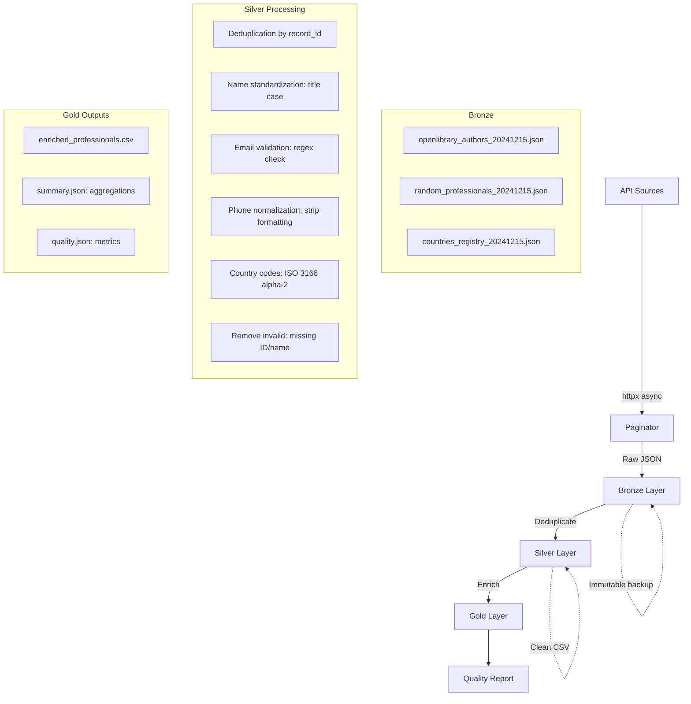

# Pipeline Architecture — Bronze-Silver-Gold

## Why This Pattern?

The Bronze-Silver-Gold (medallion) architecture separates concerns in data processing. Each layer has a distinct responsibility and mutability policy:

| Layer | Purpose | Mutability | Format |
|-------|---------|------------|--------|
| Bronze | Raw preservation | Append-only, immutable | JSON |
| Silver | Clean & standardize | Overwrite latest, keep history | CSV |
| Gold | Enrich & aggregate | Regenerated from Silver | CSV + JSON |

## Key Benefits

1. **Reprocessing** — If a bug is found in Silver logic, reprocess from Bronze without re-extracting from APIs. The raw data is always preserved.

2. **Auditability** — Every record can be traced back to the original API response in Bronze. This is critical when clients question data accuracy.

3. **Separation** — The extraction team and analysis team work independently. Extraction writes to Bronze; analysts read from Silver/Gold.

4. **Incremental** — New extractions append to Bronze. Silver merges and deduplicates across all Bronze files.

## Data Flow

## Quality Gates

Data must pass quality checks between Silver and Gold:

| Check | Threshold | Severity |
|-------|-----------|----------|
| Completeness (required fields) | >= 90% non-null | Error |
| Record ID uniqueness | 100% unique | Error |
| Email format compliance | >= 85% valid | Error |
| Phone format compliance | >= 85% valid | Warning |
| Country code format | >= 85% valid ISO | Warning |
| Data freshness | >= 90% within 24h | Warning |

If quality drops below error thresholds, the pipeline logs warnings but continues processing — allowing human review rather than silently failing.

## Processing Steps Detail

### Bronze Layer
- **Input**: `list[DirectoryRecord]` from extractors
- **Output**: `{source}_{timestamp}.json`
- **Policy**: Never modify, never delete. Append only.
- **Content**: Full API response preserved in `raw_data` field

### Silver Layer
1. **Deduplicate**: Group by `record_id`, keep latest `extracted_at`
2. **Standardize names**: Strip whitespace, title case, collapse internal spaces
3. **Standardize phones**: Strip non-digits (keep leading `+`), reject < 7 digits
4. **Validate emails**: Regex check, set invalid to `None` (don't remove record)
5. **Normalize countries**: Uppercase 2-letter ISO codes
6. **Remove invalid**: Records without `record_id` or `full_name` are rejected

### Gold Layer
1. **Geographic enrichment**: Join on country code to add region, subregion
2. **Completeness scoring**: Per-record score = non-null optional fields / total optional fields
3. **Aggregation**: Records per source, country, specialization
4. **Quality report**: Field-level completeness, uniqueness, format compliance
